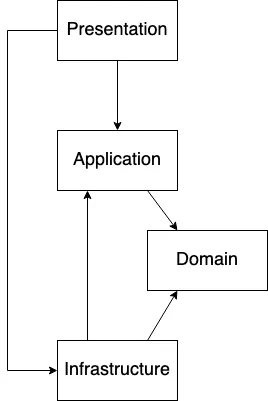

# Velox Architecture

## Domain Driven Design (DDD)

Domain-driven design (DDD) is an approach to software development that aims to align the software model with the business domain it serves. It involves several key concepts:

- Ubiquitous Language: DDD emphasizes the importance of establishing a common language between the development team and the business stakeholders. This language should be used consistently throughout the project to ensure that everyone is on the same page.

- Bounded Contexts: DDD recognizes that different parts of a software system may have different contexts and requirements. Bounded contexts define the boundaries of a specific part of the system and the language used within it.

- Entities and Value Objects: Entities are objects that have a unique identity and can change over time. Value objects, on the other hand, have no identity and are immutable. Both are important concepts in DDD for representing the business domain.

- Aggregates: Aggregates are a collection of related objects that are treated as a single unit. They are responsible for maintaining consistency and enforcing business rules within a bounded context.

- Domain Events: Domain events represent significant changes in the state of the domain model. They are used to communicate between different parts of the system and can trigger actions in other bounded contexts.

- Repositories: Repositories are used to store and retrieve domain objects from a data store. They abstract away the details of data access and provide a simple interface for the application to interact with.

DDD is a holistic approach to software design that prioritizes understanding the business domain and building a model that reflects it. By using a common language and focusing on the core concepts of the domain, developers can create more maintainable and scalable software systems.

### Domain Driven Design in Velox

The concepts of Aggregates, Entities, Value Objects, and Domain Events are all implemented in Velox using the [CQRS](https://docs.rs/cqrs-es/latest/cqrs_es/) crate. Further docs on the CQRS crate can be [found here](https://doc.rust-cqrs.org/intro.html).

Repositories are implemented using traits to provide a simple interface for the application to interact with, although this implementation is subject to change.

The concepts of Bounded Contexts and Ubiquitous Language are important concepts to apply when designing a domain model, however are not implemented in Velox as there isn't a real domain for the stack itself.

## Domain Driven Design Layers

Velox implements the layers as specified in domain driven design.

### Presentation Layer

The Presentation Layer is responsible for handling user interactions and presenting information to users. It is where the user interface resides and it interacts with the application layer to get and process the required data. The presentation layer should be designed in such a way that it is decoupled from the application layer to enable the application layer to evolve independently. It is important to design the presentation layer with a user-centric approach that focuses on the user's needs and requirements, rather than solely on technical implementation details. The presentation layer should be easy to maintain, extend and change, and it should follow the SOLID principles of software design.

### Application Layer

The Application Layer is responsible for coordinating business logic and translating high-level commands from the Presentation Layer into lower-level operations that can be performed by the Domain Layer. The Application Layer acts as a facade that hides the complexity of the Domain Layer from the Presentation Layer and other clients. It is responsible for transaction management, security, and validation. It should also enforce business rules and policies, and orchestrate the interactions between different parts of the system. The Application Layer should be designed in such a way that it is reusable, extensible, and testable. It should be loosely coupled to the other layers of the system, enabling each layer to evolve independently.

### Domain Layer

The Domain Layer represents the core of the business logic and knowledge of the system. It encapsulates the domain concepts, business rules, and behaviors of the system. The Domain Layer should be designed with a domain-centric approach that focuses on the understanding and modeling of the domain, rather than technical implementation details. It should be designed to be reusable and extendable, enabling the domain model to evolve as the business requirements change. The Domain Layer should also be decoupled from the infrastructure and application layers, allowing it to be tested independently and to support multiple user interfaces and data sources. The Domain Layer is critical to the success of a Domain Driven Design project as it is the source of competitive advantage and differentiation for the system.

### Infrastructure Layer

The Infrastructure Layer is responsible for providing support to the other layers by providing the necessary technical infrastructure such as databases, messaging systems, and external services. The Infrastructure Layer should be designed to be decoupled from the other layers to enable them to evolve independently. It should also provide abstractions and interfaces that shield the Domain Layer and Application Layer from the complexities of the underlying infrastructure. The Infrastructure Layer should be designed to be modular and replaceable, enabling the system to adapt to changing technical requirements and to support different deployment environments. The Infrastructure Layer is critical to the success of a Domain Driven Design project as it provides the foundation upon which the other layers can build.
